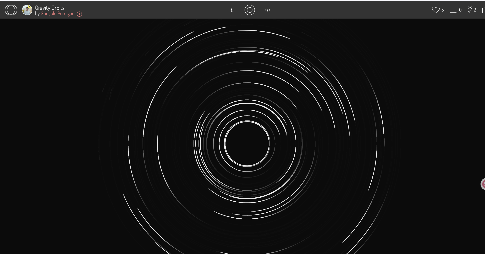
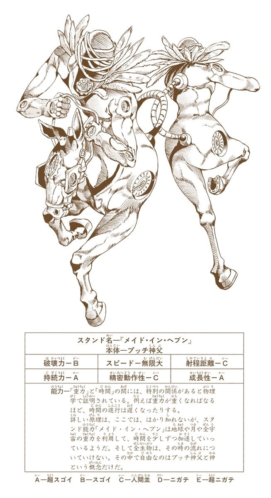

# tut5_GroupB_qgon0886
## Time-Driven Visual Animation Project
### Project Overview
The project is based on p5.js generated visual animations over time. It was inspired by the starry sky and the animation *JoJo's Bizarre Adventure: Stone Ocean*.
The project presents a forty-second long looping animation effect that is divided into four stages:
*0-10s*
The dots and pointers will rotate slowly.
*10-20s*
The rotation starts to accelerate and the pointer and dots show a trailing effect.
*20-30s*
The rotation reaches its maximum speed and the colors of the circles and dots change.
*30-40s*
The rotation speed becomes slow.

### How to use
The project's pattern changes on its own depending on the time, and the user can refresh the process with a click of the mouse, but otherwise there is no other action.

### Technical Details
•Built with the p5.js framework.

•Uses millis() to control animation rhythm over time

•Divides a 40-second loop into four 10-second phases.

•millis() and modulo % are used to calculate the current phase.
lerp() is used to smoothly transition for Red dot trail length and Rotation speed.

•Maps time-based values to visual elements using lerp() and map():
Longer dots trails during high-speed phases
The speed of red dot rotation increases in acceleration phase, and keeps unchanged at peak
Color palette change only use once at the start of the high-speed phase
Creating motion trails by using transparency in background

•Trail Effect
Trail effect is implemented using dotsTrail to store previous dot positions, each ring has a list of points representing trail history, and dots fade with age by decreasing alpha over time using map()

### Visual Design Highlights
•Associating the rotation and pointers, which are traced in a ring, with a clock, combines with the technique and concept of time.
•Red dots rotate along concentric rings with fading trails, simulating motion blur and creating a hypnotic, dynamic visual rhythm.
•Central bezier curves rotate like clock hands, adding mechanical and organic
•The change in color when the rotation reaches maximum speed to the change in the world that occurs when time accelerates to near infinity in the source of inspiration.

**Compared to my teammates:**
•One focused on using Bézier curves and scale changes
•Another focuses on a combination of expanding ripple effects and dynamic dots
•My version focuses on using the trailing effect of the dots and pointers as well as the speed of the rotation to visually show the concept of time as well as the changes.

### Inspiratiom
**Starry sky in time-lapse photography**
[Inspiration and techinque from](https://openprocessing.org/sketch/2490402)

**JoJo's Bizarre Adventure: Stone Ocean**
This was inspired by the comic's character, Enrico PUcci, with his superpower, “Made in Heaven". Made in Heaven's power is to dramatically speed up the flow of time. Upon activation, time will gradually flow faster and faster in the whole universe, as time continues to accelerate, the universe will hit a "vanishing point", and a new universe will be created
